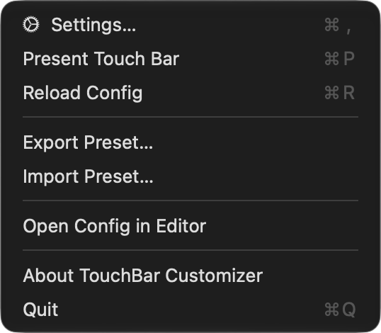
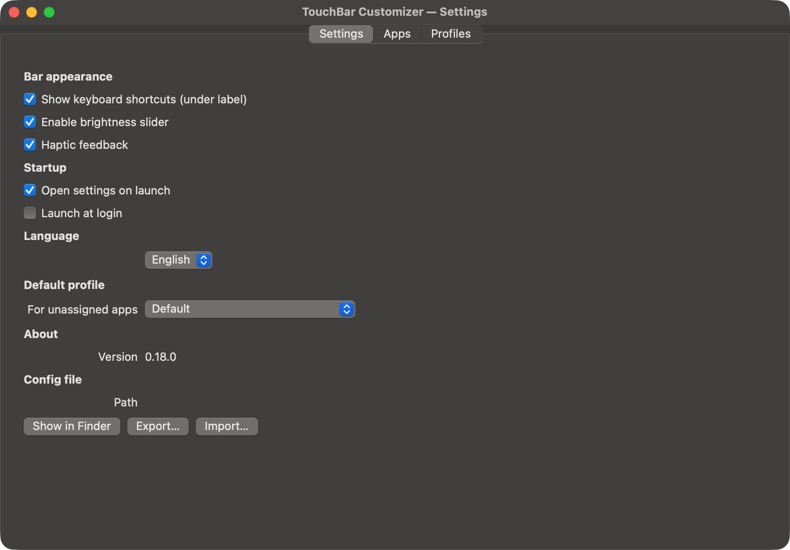
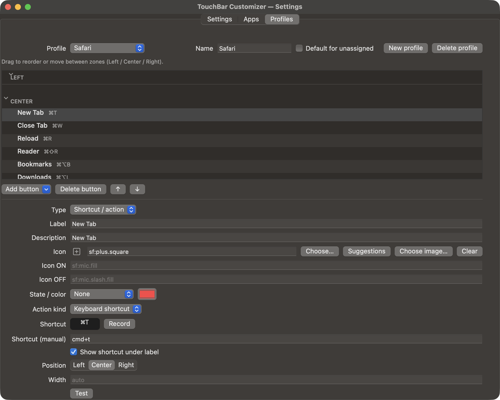
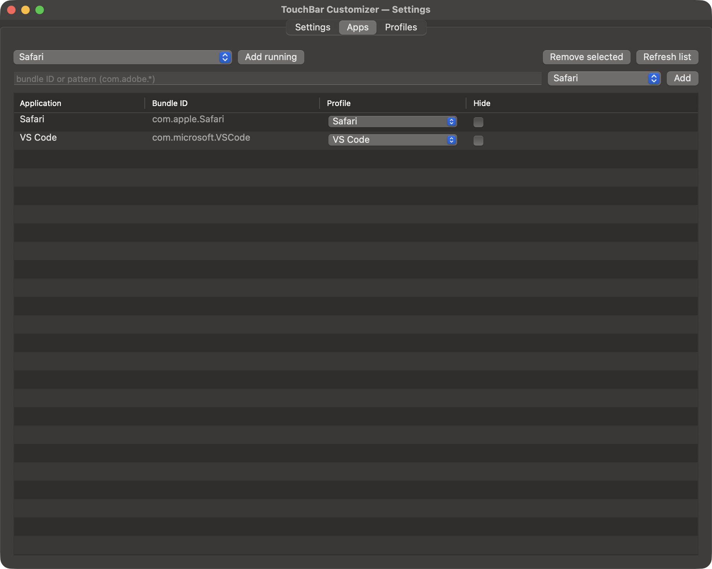
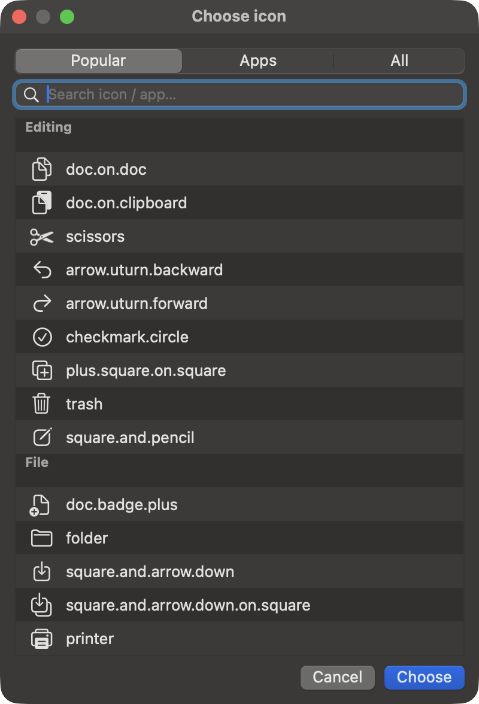
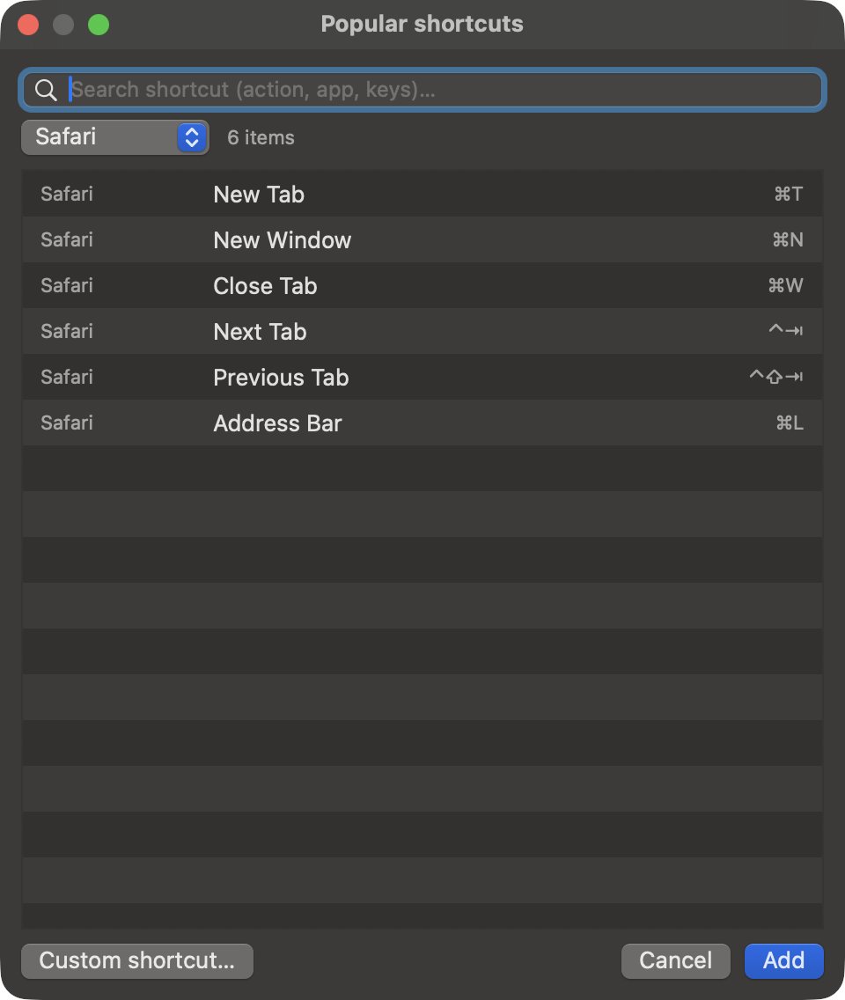
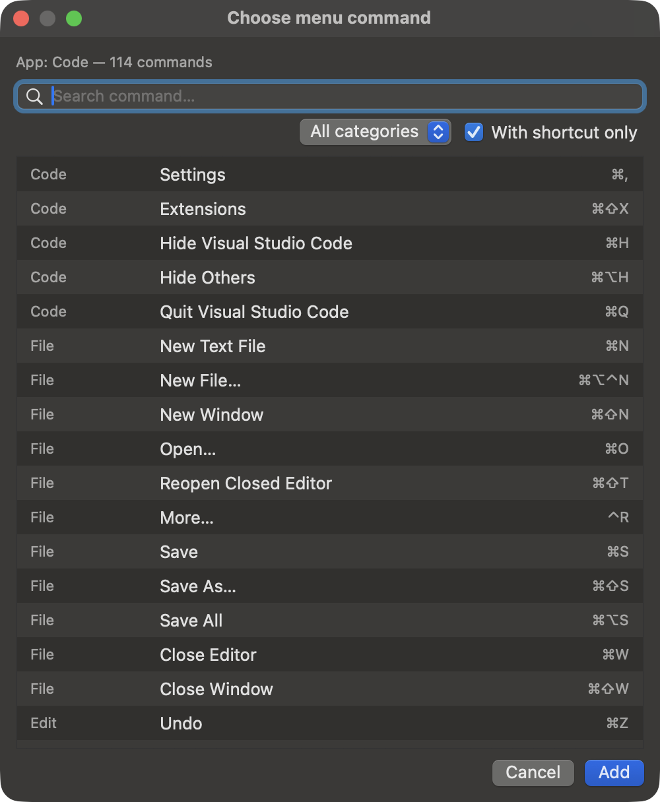

# TouchBar Customizer

A macOS menu bar app that turns the Touch Bar into a fully customisable,
per-application toolbar. Define your own buttons, icons and shortcuts for every
app — the Touch Bar follows whatever is in front, and falls back to a default
bar for everything else.

## Downloads

Get the latest version from the [Releases page](https://github.com/retrocompxyz/touchbar-customizer/releases/latest):

- **`TouchBarCustomizer-<version>-universal.dmg`** — for Apple Silicon **and** Intel Macs.
- **`TouchBarCustomizer-<version>-arm64.dmg`** — Apple Silicon only (smaller download).

## Requirements

- A MacBook **with a Touch Bar** (the Touch Bar itself cannot be added to Macs without one).
- macOS 13 (Ventura) or newer.
- The **universal** build runs on both Apple Silicon and Intel.
- The **arm64** build runs on Apple Silicon only.

## Installation

1. Download the DMG of your choice.
2. Open the image and drag `TouchBar-Customizer.app` into the `/Applications` folder.
3. Launch it — an icon will appear in the menu bar.

> **First launch / Gatekeeper.** The app is not notarized by Apple, so macOS may
> block it with a warning. Either right-click the app and choose **Open**, or run:
>
> ```
> xattr -dr com.apple.quarantine "/Applications/TouchBar-Customizer.app"
> ```

> **Accessibility.** Some features (menu commands, sending shortcuts, reading the
> Discord state) need the app to be granted **Accessibility** permission in
> System Settings → Privacy & Security.

## Screenshots

**The menu bar menu** — open the editor, export/import presets, or present the bar on demand.



**Settings → Settings** — appearance, startup, language and the default profile.



**Settings → Profiles** — the per-app button editor, with Left / Center / Right zones.



**Settings → Apps** — map applications to profiles (with wildcard patterns).



**Icon picker** — SF Symbols, application icons and custom image files.



**Popular shortcuts** — a built-in catalog of common app shortcuts, ready to add.



**Command palette** — pick any command straight from an app's own menu.



## Features

- **Per-application Touch Bar profiles** — a different bar for each app.
- **Visual editor** with Settings / Apps / Profiles tabs.
- **Drag & drop** ordering with **Left / Center / Right** zones, spacers and separators.
- **Groups** with bar-swap navigation.
- **Icons**: SF Symbols, application icons, or your own images.
- **Actions**: keyboard shortcuts, system keys, shell scripts, AppleScript,
  open URL, open app, menu commands, shortcut-in-app, and more.
- **Popular shortcuts** catalog and **command palette** from any app's menu.
- **Status widgets**: Now Playing, Battery, Wi-Fi, CPU, Dock and AirDrop.
- **Sliders** for brightness, volume and keyboard illumination, plus mute.
- **Real Discord mute/deafen state** shown on the bar.
- **Stateful buttons** (on/off icons).
- **Bilingual UI**: Polish and English.
- **Import / export** of presets.
- **Launch at login** and haptic feedback.

## Usage

Click the menu bar icon to open **Settings…**, present the Touch Bar, reload the
config, or export/import presets.

In the **Profiles** tab, add buttons and arrange them into zones. For each button
you can set a label, an icon, an action and a position. Use **From app menu…** to
add any command from a running application's menus, or **Popular shortcuts…** for
common actions.

Assign applications to profiles in the **Apps** tab. Apps without an assignment
use the **default profile**.

## Configuration and data

- Configuration: `~/Library/Application Support/TouchBarCustomizer/config.json`

The configuration is plain JSON and is **hot-reloaded** while the app runs, so you
can edit it by hand (or sync it) and the bar updates on the fly.

## Notes

- TouchBar Customizer uses private Touch Bar APIs; those are not part of the public
  macOS SDK and may change in future system versions.
- The app is **not notarized** by Apple (see Installation).

## Author

**RetroComp** — [www.retrocomp.xyz](https://retrocomp.xyz)

## License

Licensed under the **PolyForm Noncommercial License 1.0.0** — free to use for
noncommercial purposes. Commercial use and selling are not permitted; the author
retains all commercial rights. See [LICENSE](LICENSE) for the full text.
